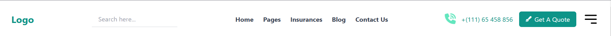
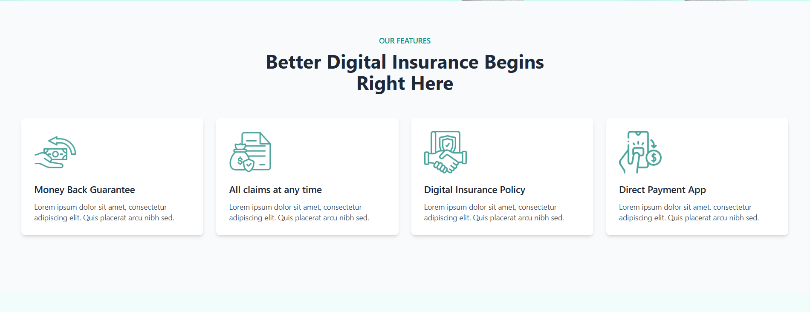
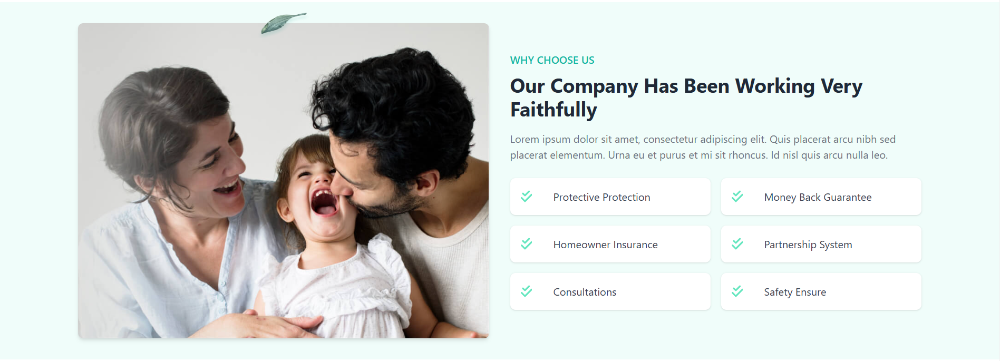
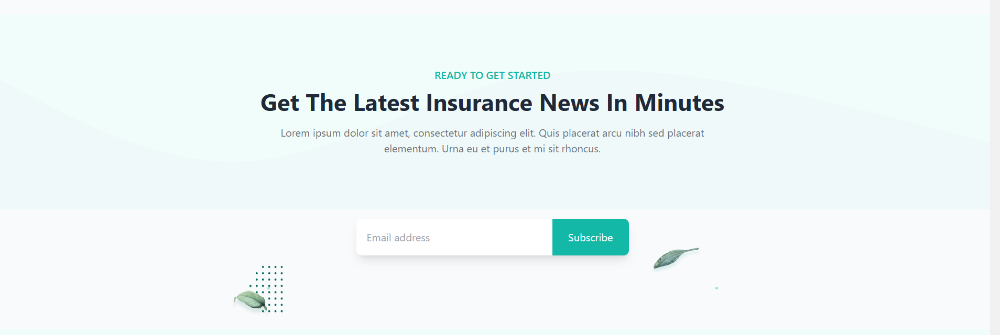
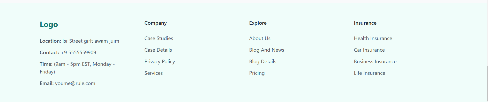

# InsuranceProject

This project was generated with [Angular CLI](https://github.com/angular/angular-cli) version 17.3.9.

## Table of contents

- [Overview](#overview)
  - [The challenge](#the-challenge)
  - [Screenshot](#screenshot)
  
- [My process](#my-process)
  - [Built with](#built-with)
  - [What I learned](#what-i-learned)
 

- [Acknowledgments](#acknowledgments)

## Overview

### The challenge

- Replicate the specified insurance website design page using Angular and Tailwind CSS to create a fully responsive, professional-grade landing page

## Screenshots
### Header

### Hero Section

### Features Section

### About Section

### Insurance Services Section

### Why Choose Us Section

### Call To Action ( Newsletter )

### Footer Section

### Built with

- Semantic HTML5 markup

- Tailwindcss

- Typescript

- Angular
- [Styled Components](https://styled-components.com/) - For styles

### What I learned

- Component creation and structure in Angular.
- Background Zero Index and Transform properties.

## Acknowledgments

Elan Sir and Gopi sir for teaching Angular code structure and best practices.

## Development server

Run `ng serve` for a dev server. Navigate to `http://localhost:4200/`. The application will automatically reload if you change any of the source files.

## Code scaffolding

Run `ng generate component component-name` to generate a new component. You can also use `ng generate directive|pipe|service|class|guard|interface|enum|module`.

## Build

Run `ng build` to build the project. The build artifacts will be stored in the `dist/` directory.

## Running unit tests

Run `ng test` to execute the unit tests via [Karma](https://karma-runner.github.io).

## Running end-to-end tests

Run `ng e2e` to execute the end-to-end tests via a platform of your choice. To use this command, you need to first add a package that implements end-to-end testing capabilities.

## Further help

To get more help on the Angular CLI use `ng help` or go check out the [Angular CLI Overview and Command Reference](https://angular.io/cli) page.
